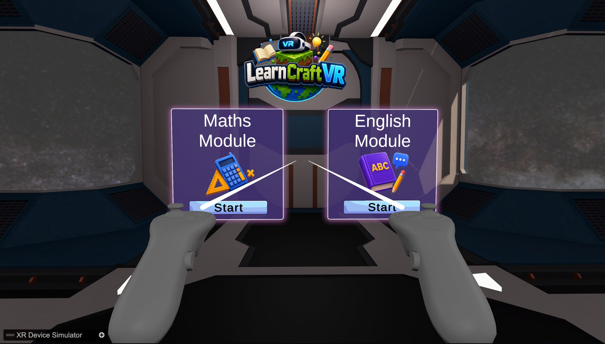
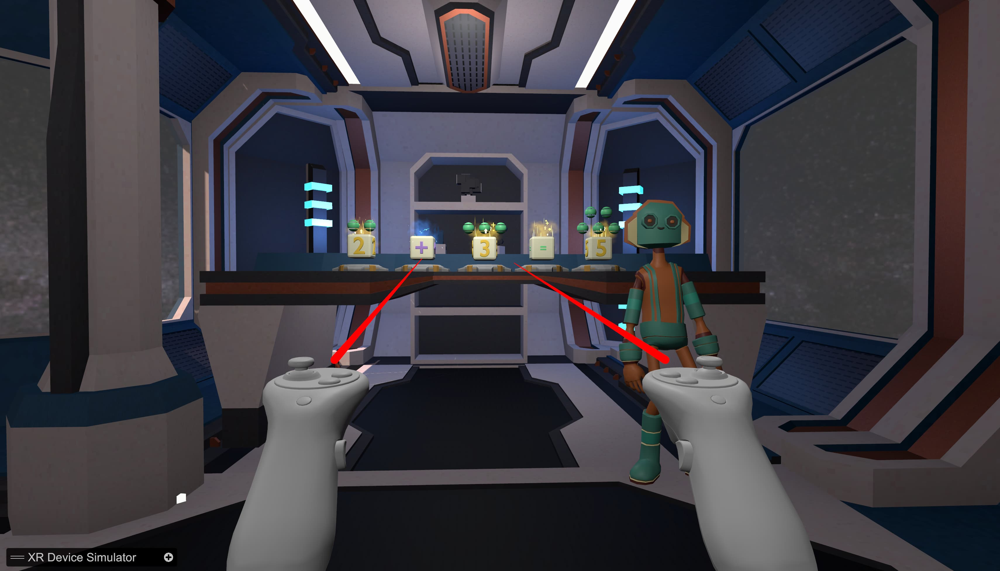
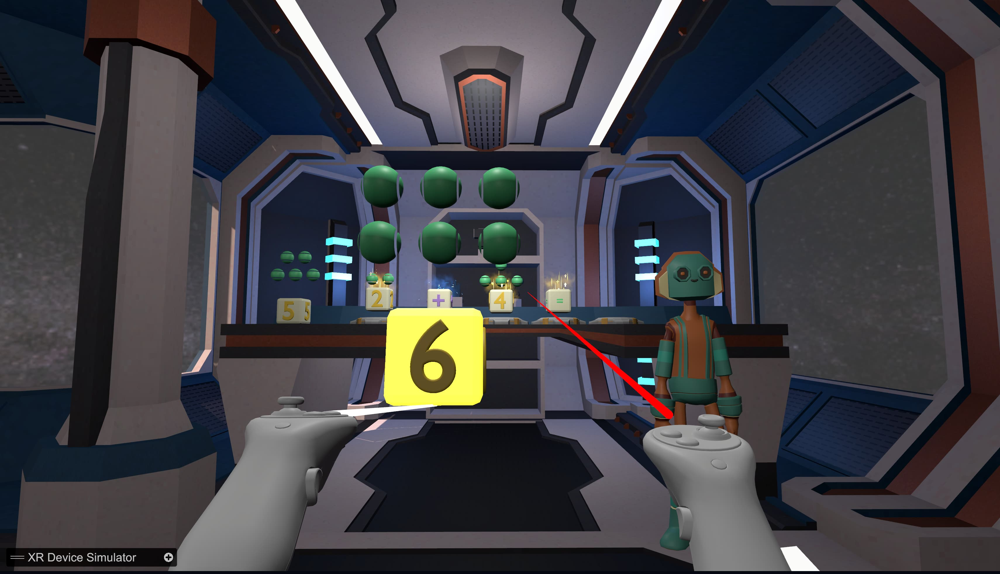
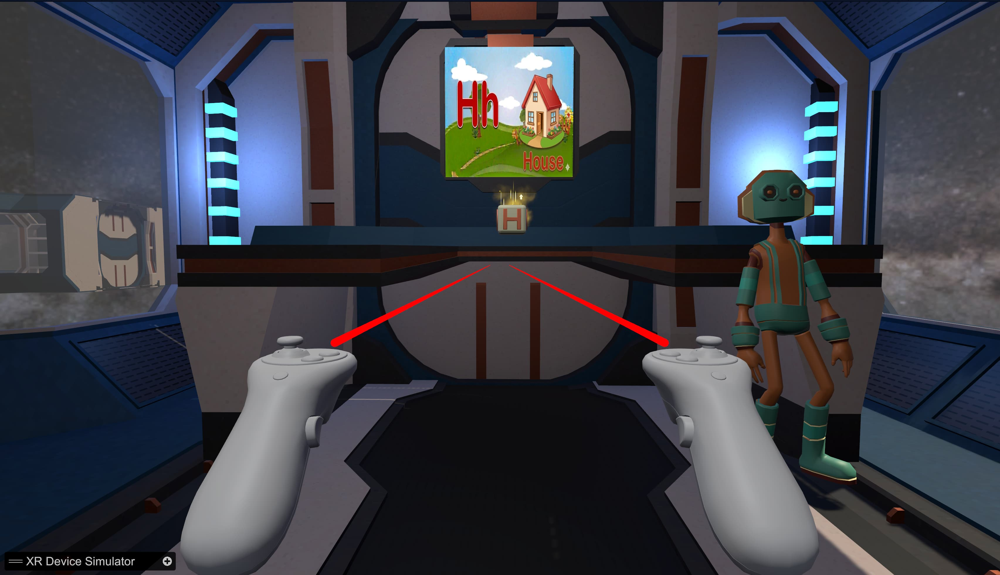
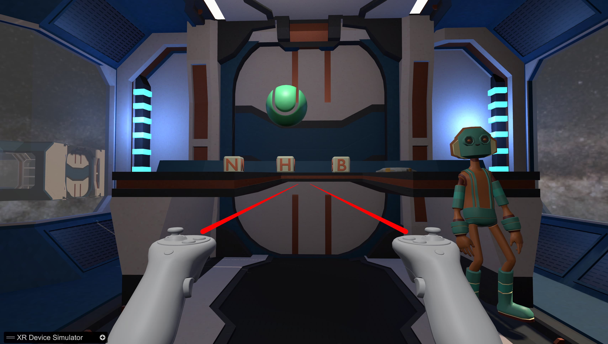

# LearnCraft VR

An immersive **Virtual Reality educational game** that teaches **Mathematics** and **English** through interactive lessons, AI-guided instruction, and gamified learning experiences.

---

## Game Concept

Players begin in the **Main Menu**, where the AI Deskbot welcomes them and introduces the game. After the introduction, players choose one of the available learning modules:

- Mathematics Module
- English Module

Each module consists of multiple interactive rooms where learners first understand the lesson and then complete VR-based activities to progress.

---

## Mathematics Module

The Mathematics module contains four learning rooms:

- Addition
- Subtraction
- Multiplication
- Division

### Gameplay

- The AI Deskbot explains each mathematical concept.
- A quiz is presented after the lesson.
- Players grab the correct answer block using VR controllers.
- Correct answers trigger a celebration animation.
- Incorrect answers receive instant feedback from the Deskbot.
- Players are automatically teleported to the next room after completing the activity.

---

## English Module

The English module consists of four interactive learning rooms.

### Room 1 – Alphabets (A–M)

- Learn alphabets from **A to M**.
- A random 3D object appears.
- Players identify and place the correct first letter.

### Room 2 – Alphabets (N–Z)

- Learn alphabets from **N to Z**.
- Continue identifying objects and their starting letters.

### Room 3 – Word Completion

- Learn simple words.
- Complete missing letters based on the displayed 3D object.

### Room 4 – Sentence Building

- Learn basic sentence construction.
- Arrange shuffled word blocks into the correct order.
- If needed, numbered hints appear above the blocks to assist the learner.

---

## Features

- Immersive Virtual Reality learning environment.
- AI Deskbot with voice-guided instruction.
- Interactive Mathematics learning activities.
- Interactive English learning activities.
- Puzzle-based learning through object interactions.
- Real-time answer validation and feedback.
- Celebration animation for correct answers.
- Automatic room progression after completing each activity.
- Hint system for sentence-building activities.
- Custom 3D assets created using Blender.

---

## Tech Stack

- Unity
- C#
- XR Interaction Toolkit
- OpenXR
- Blender
- Git
- GitHub
- Meta Quest 3S

---

## Game Output

### Main Menu

  

---

### Mathematics Learning

  

---

### Mathematics Quiz

  

---

### English Learning

  

---

### English Quiz

  

---

# Copyright

© 2026 Anuj Jadhav. All Rights Reserved.

This repository and its contents, including but not limited to the source code,
Unity project files, C# scripts, 3D models, textures, animations, audio,
documentation, and other assets, are the intellectual property of Anuj Jadhav.

This project is publicly available for viewing and educational purposes only.
No part of this repository may be copied, reproduced, modified, redistributed,
or used in personal, academic, or commercial projects without prior written
permission from the copyright holder.

Unauthorized use, distribution, or reproduction of this project or its assets
may result in legal action.

For licensing or permission requests, please contact:
- GitHub: https://github.com/Anuj0720
- LinkedIn: https://www.linkedin.com/in/anuj-jadhav-8814b5302/

---

## License

This project is licensed under a custom **All Rights Reserved** license.
See the [LICENSE](LICENSE) file for complete terms.
